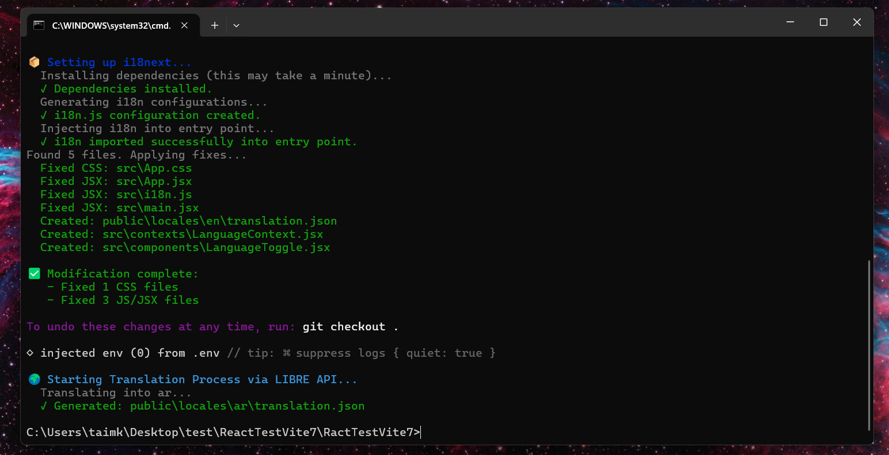

# Meridian

<div align="center">
  

  <br />

  <a href="https://github.com/Taimkellizy/meridian-suite">
    
  </a>
  <a href="https://meridian-suite.vercel.app/">
    
  </a>
  <a href="https://opensource.org/licenses/MIT">
    
  </a>

  <br />
  <br />

  
  
  
  
  
</div>

> **Note:** A full, comprehensive documentation website is currently in development and will be available prior to the official release at [meridian-suite.vercel.app](https://meridian-suite.vercel.app/). This README serves as a technical overview and development guide.

Meridian is a comprehensive internationalization automation tool that transforms any React application into a global-ready product with a single command. Unlike traditional i18n libraries that require manual setup and configuration, Meridian handles the entire migration process: CSS modernization, string extraction, translation, i18next setup, and ongoing prevention through linter integration.

## Table of Contents

- [Key Features](#key-features)
- [Tech Stack](#tech-stack)
- [Prerequisites](#prerequisites)
- [Getting Started](#getting-started)
- [Architecture](#architecture)
- [Environment Variables](#environment-variables)
- [Available Scripts](#available-scripts)
- [Contributing, Testing, and Deployment](#contributing-testing-and-deployment)

## Key Features

- **One-Command Setup**: `meridian init` handles the entire i18n process for you.
- **Runtime Adapter System**: Meridian automatically detects your Next.js router type (Pages Router or App Router) and selects the correct runtime adapter — `next-i18next` or `next-intl` — using a 7-rule priority chain (CLI flag → `package.json` deps → filesystem heuristics → `next.config.js` flags). It supports wrapped configuration exports (e.g. Sentry or bundle-analyzer wrappers) out of the box. Use `--adapter pages-router` or `--adapter app-router` to override.
- **Tailwind CSS Support**: Fully integrated with Tailwind CSS. meridian automatically scans, rewrites, and modernizes Tailwind utility classes, injecting dynamic RTL logical utilities.
- **CSS Modernization**: Automatically detects and replaces physical CSS properties (e.g., `margin-left`) with logical ones (e.g., `margin-inline-start`). Generates project-aware logical mappings for both Tailwind v2 and v3/v4.
- **RTL Layout Symmetry**: Intelligently identifies layout-critical `translate-x` transformations and applies surgical `.meridian-rtl-mirror` and `.meridian-rtl-translate-reverse` CSS utilities to preserve exact spatial positioning and SVG mirroring in RTL mode without breaking original LTR layouts.
- **Semantic String Extraction**: Uses `recast` and Babel to scan JSX/TSX and automatically wrap hardcoded text, JSX attributes, dynamic config values, and mapped data arrays with `t()`, fully preserving your original source code formatting and line endings. Automatically generates scalable **Context-Aware Keys** (e.g., `hero.title`) preventing key collisions across languages and namespaces.
- **Intelligent Pre-flight Checking**: Automatically detects legacy environments (React < 16.8, TypeScript < 5.0) and intelligently installs compatibility-friendly i18n packages to prevent build errors.
- **Data File Promotion**: Scans common project data locations such as `src/config`, `src/data`, `src/content`, `src/constants`, and configured custom files, then promotes display strings into locale files.
- **Next.js Support**: Detects both App Router and Pages Router projects, including `src/pages/_app.tsx`, and generates SSR-safe i18next configuration.
- **Auto-Translation Engine**: Deep integration with Google Translate, DeepL, and LibreTranslate APIs. Adds new languages on the fly via CLI and dynamically scales UI components.
- **Intelligent Component Injection**: Target specific DOM elements by HTML tag (`nav`, `header`, `custom`) or HTML ID (`#main-nav`), with granular append/prepend controls.
- **Multi-Language Switcher**: Generated language controls cycle through all configured languages, not only a two-language pair.
- **Continuous Integration (CI/CD)**: Run `meridian sync --ci` in your GitHub Actions via the automatically generated `i18n-check.yml` workflow to block PRs with orphaned strings or missing translations.
- **Prevention via Linters (Coming Soon)**: Custom ESLint and Stylelint plugins to prevent future localization bugs will be available post-release.

## Day-to-Day Editing Workflow

| I want to… | What I do |
| --- | --- |
| Change display text that comes from a data file (`index.json`, etc.) | Edit the value in the source data file, then run `meridian sync` |
| Change display text that was hardcoded in JSX | Edit the value in `public/locales/en/translation.json` for that key, then run `meridian sync` |
| Add a new entry with text to a data file | Edit the data file normally, then run `meridian sync` |
| Add a new hardcoded string to a JSX component | Write it as plain text, then run `meridian sync` — it will wrap and register it automatically |
| Fix a wrong translation in a specific locale | Edit that locale's `translation.json` directly — no sync needed |
| Translate newly added strings | Run `meridian sync <locale> [locale...]` (e.g. `meridian sync ar es`) |
| Remove a string that's no longer used | Remove it from source, run `meridian sync --check` to confirm it's orphaned, then `meridian sync --prune` |
| Rename a translation key | Do not do this manually — keys are managed by Meridian. Change the value, not the key |

> **Never rename `t()` keys manually in JSX.** Keys are owned by Meridian and tracked in `.meridian/key-map.json`. Manually renaming a key in a component will cause that string to fall back to displaying the raw key name at runtime. If a key name is wrong, file an issue or run `meridian sync` — it will regenerate keys for strings that have been significantly changed.

## Tech Stack

- **Language**: JavaScript / Node.js
- **Architecture**: Monorepo (using `Turborepo` & `npm workspaces`)
- **Parsers**: PostCSS (CSS architecture), Babel (JSX AST processing), Recast (format-preserving AST edits)
- **Translators**: Third-party APIs (Google, DeepL, LibreTranslate)
- **Target Integrations**: `next-i18next` (Pages Router), `next-intl` (App Router), `react-i18next`
- **Landing Page & Docs**: React, Tailwind CSS, GSAP (ScrollTrigger & Core for high-performance animations)

## Prerequisites

- Node.js 18 or higher
- npm 9+ (using workspaces capabilities)

## Getting Started

### 1. Clone the Repository

```bash
git clone https://github.com/Taimkellizy/meridian-suite.git
cd meridian-suite
```

### 2. Install Dependencies

Since Meridian is managed as an npm workspaces monorepo, a top-level install will link the `@meridian/cli` and `@meridian/core` packages locally.

```bash
npm install
```

### 3. Environment Setup

For auto-translation, you need to provide the relevant API keys. Copy the example environment file for the CLI:

```bash
cp packages/cli/.env.example packages/cli/.env
```

Configure your translation endpoints:

| Variable                  | Description                        | Example                           |
| ------------------------- | ---------------------------------- | --------------------------------- |
| `MERIDIAN_GOOGLE_API_KEY` | Google Translate API Key           | `AIzaSyB...`                      |
| `MERIDIAN_DEEPL_AUTH_KEY` | DeepL Authentication Key           | `e9b...`                          |
| `MERIDIAN_LIBRE_ENDPOINT` | Custom LibreTranslate endpoint URL | `http://localhost:5000/translate` |

### 4. Running the CLI Locally

During development, you can invoke the CLI from the root using `npm` or simply run the CLI node script directly against example React applications:

```bash
node packages/cli/bin/meridian.js init --path ../examples/my-react-app
```



## Architecture

Meridian is built using a modern Monorepo structure to decouple CLI logic from language-agnostic parsers and linter plugins.

### Directory Structure

```text
meridian-suite/
├── apps/
│   ├── web/                    # Interactive marketing landing page & Documentation (React + GSAP)
│   └── examples/               # Sandboxed React repos to test Meridian against
├── packages/
│   ├── cli/                    # Main CLI application (`meridian`)
│   │   ├── bin/                # Executable entry point (meridian.js)
│   │   ├── commands/           # Specific terminal commands (init, extract, etc.)
│   │   ├── utils/              # Installers & config management components
│   │   │   ├── runner.js       # Core init pipeline (adapter-aware)
│   │   │   ├── sync-runner.js  # Incremental sync & reconciliation pipeline
│   │   │   └── translator-runner.js # Translation dispatch (adapter-aware)
│   │   └── templates/          # Boilerplates for injecting `i18next` and Button UI
│   ├── core/                   # Shared parsers and logic
│   │   ├── src/
│   │   │   ├── adapters/       # Runtime adapter system
│   │   │   │   ├── index.js              # getAdapter() & detectAdapter() factory
│   │   │   │   ├── nextI18nextAdapter.js # Pages Router adapter
│   │   │   │   ├── nextIntlAdapter.js    # App Router adapter
│   │   │   │   ├── helpers.js            # Shared AST helpers for both adapters
│   │   │   │   └── shared/
│   │   │   │       ├── nextConfigHelper.js # mergeI18nBlock() & wrapWithPlugin()
│   │   │   │       └── recastUtils.js      # hasImport(), hasJSXAttribute()
│   │   │   ├── parsers/        # PostCSS, JSX (Babel), and TypeScript AST walkers
│   │   │   ├── detectors/      # Heuristic engines for finding physical properties
│   │   │   ├── utils/
│   │   │   │   ├── reactGenerators.js         # LanguageContext & LanguageToggle templates
│   │   │   │   └── reactInjection/
│   │   │   │       └── injectElements.js      # Pure AST analysis & string-edit injection
│   │   │   └── fixers/         # Replacers mapping physical -> logical properties
│   │   └── index.js            # Public API surface (re-exports adapters + all utilities)
│   ├── eslint-plugin/          # (Coming Soon) ESLint Plugin for real-time prevention
│   ├── stylelint-plugin/       # (Coming Soon) Stylelint Plugin avoiding future broken CSS layouts
│   └── translator/             # API connectors connecting to Google/DeepL/Libre
├── package.json                # Root package with workspace configurations
└── turbo.json                  # Turborepo orchestrated pipelines
```

### Request Lifecycle (The `init` Flow)

1. **User runs `meridian init`**: CLI collects targets (languages, endpoints) via interactive prompt.
2. **Adapter Detection**: `detectAdapter()` applies a 7-rule priority chain to select the correct runtime adapter (`next-i18next` for Pages Router, `next-intl` for App Router). The result is persisted to `.meridian/config.json` for all future commands.
3. **Adapter Install & Runtime Injection**: The selected adapter installs its dependencies and injects its runtime configuration files (e.g., `next-i18next.config.js`, `middleware.ts`, `src/i18n/request.ts`).
4. **PostCSS Modernizer**: `core/parsers/cssParser` walks CSS AST, translating `left`/`right` rules to `inline-start`/`inline-end` while preserving file formats.
5. **Project Detection**: Detects React and Next.js projects, including Next.js App Router and Pages Router entry files.
6. **Data Registry Scan**: Scans JSON/JS data files in common content directories and any `.meridianrc.json > dataFiles` entries. Display values from config files are promoted into `src/i18n/messages/<defaultLang>.json`.
7. **Babel String Extractor**: Walks the AST of the target project, detecting text nodes, attributes, member expressions, optional chaining, method chains, and mapped arrays. It applies surgical source edits so formatting is preserved as much as possible.
8. **Auto-translator Pipeline**: Iterates over extracted JSON structures, forwarding payload chunks to the requested Translator Provider, waiting iteratively if rate-limit constraints surface. The active adapter's `writeLocaleFiles()` is then called to distribute translations into the adapter-specific directory structure.
9. **Linter Installation (Coming Soon)**: CLI drops `.eslintrc.js` enhancements to integrate linting rules.
10. **Report**: Success statistics display in the console.

### Key Components

#### Runtime Adapter System

Meridian's adapter system (`packages/core/src/adapters/`) provides a clean interface over the two dominant Next.js i18n strategies:

| Adapter | Router type | Key files generated |
| --- | --- | --- |
| `NextI18nextAdapter` | Pages Router (`pages/`) | `next-i18next.config.js`, wraps `_app.tsx`, injects `getStaticProps` |
| `NextIntlAdapter` | App Router (`app/`) | `src/i18n/request.ts`, `middleware.ts`, wraps `next.config.js` with `withNextIntl` |

Both adapters share a common `helpers.js` for AST manipulation and `shared/nextConfigHelper.js` for safe `next.config.js` edits. Detection uses a 7-rule priority chain exposed via `detectAdapter(projectRoot, flagValue?)`:

1. CLI `--adapter` flag
2. `next-intl` in `package.json` (wins)
3. `next-i18next` in `package.json` (wins)
4. Both present → throws ambiguity error
5. `app/` directory only → `next-intl`
6. `pages/` directory only → `next-i18next`
7. Both or neither → throws descriptive error

#### CSS Modernization Tracker

- Replaces physical CSS attributes securely without guessing context by determining if it's applied inside a legitimate stylistic container.
- Fully supports shorthand replacements (4-value and 2-value margins and paddings).

#### Intelligent React Injector

- Features granular DOM injection controls: Target components explicitly by HTML Tag (e.g. `nav`, `aside`, `custom`), or target exact elements by HTML ID.
- Supports both `Append` and `Prepend` injection modes for flawless structural alignment.
- **Double-Wrap Prevention**: Astutely scans root layouts (like `_app.tsx`) to guarantee that `I18nextProvider` and `LanguageProvider` are never redundantly injected multiple times.
- Dynamically generates the UI footprint: Renders simple buttons for 2 languages, but securely auto-scales to native `<select>` dropdown menus when 3 or more languages are requested.
- Recognizes application indent spacing and adapts to it.
- The injection engine (`injectElements.js`) operates via pure AST analysis functions (`analyzeExportDefault`, `analyzeAppRouterLayout`, `analyzeToggleTarget`) that return coordinate objects, and separate string-edit generators (`generateProviderWrapperEdit`, `generateToggleInsertEdit`) that produce precise character-range replacements — ensuring source formatting is never destroyed.

#### Next.js SSR Locale Routing

- For Pages Router projects, the `NextI18nextAdapter` uses `mergeI18nBlock()` to safely inject the `i18n` block into `next.config.js` via AST, then wraps `_app.tsx` with `appWithTranslation` and injects `getStaticProps` + `serverSideTranslations` into each page file.
- **Manual Injection Note:** If your `next.config.js` is wrapped in higher-order functions or plugins (e.g. `module.exports = withBundleAnalyzer(...)`), Meridian's safety constraints will intentionally **abort** the injection to prevent breaking your build. In this scenario, you must add the block manually inside the exported object:

  ```javascript
  module.exports = withBundleAnalyzer({
    // ... your existing config
    i18n: { locales: ['en', 'ar', 'es'], defaultLocale: 'en' }
  });
  ```

- For App Router projects, the `NextIntlAdapter` uses `wrapWithPlugin()` (Recast-based) to wrap the default export in `next.config.js` with `withNextIntl(...)`, generates `src/i18n/request.ts` and `middleware.ts`, and updates the root `layout.tsx` to pull `dir` and `lang` directly from route segment `params`. If your layout has no parameters at all (`export default function Layout() { ... }`), Meridian will throw a descriptive error requesting you to manually add `({ children, params })` to the signature for safe insertion.

#### Data-Aware JSX Extraction

- Wraps config-backed expressions such as `{product.title}`, `{plan.name}`, `{plan.price}`, and `{plan.priceDetails}` only when the scanned data registry marks those fields as display text.
- Handles optional chaining and method chains, including patterns such as `product.title.split(' ').map(...)`.
- Handles mapped arrays without translating the array object itself. For example, `plan.features.map((feature) => <li>{feature}</li>)` becomes `plan.features.map((feature) => <li>{t(feature)}</li>)`.
- Promotes JSON array items such as pricing features into locale files so runtime `t(feature)` calls have matching keys.
- Uses flat runtime keys for promoted data values, where the English source string is both the key and the default value. This matches dynamic calls like `t(plan.name)` and `t(feature)`.

#### Context-Aware Translation Keys

- Meridian intelligently infers contextual translation keys using a `<namespace>.<scope>.<role>` format:
  - **Namespace**: Derived from the file path and stem (e.g., `src/components/Hero.jsx` -> `hero`).
  - **Scope**: Identified by traversing the AST up to the enclosing component or function.
  - **Role**: Discovered dynamically via explicit developer comments (`{/* i18n: headline */}`), JSX attributes (`alt`, `title`), HTML tags, or sluggified strings.
- Keys are collision-safe, auto-incrementing safely within a namespace (e.g., `hero.body`, `hero.body2`).
- Generated keys are stored with deterministic AST traversal signatures in `.meridian/key-map.json`, guaranteeing perfectly idempotent generations on successive extractions without overwriting manual developer overrides.

#### Incremental Sync Pipeline

- `meridian sync` uses a timestamp-based incremental extraction strategy: only files modified since the last sync (tracked in `.meridian/last-sync`) are re-processed.
- New strings are immediately appended to the default locale file and stubbed as empty strings in all other locale files, ready for translation.
- Delta translation support: when new strings are detected, only the newly added keys are forwarded to the translation API rather than re-translating the entire file, dramatically reducing API costs.
- After translation, the active adapter's `writeLocaleFiles()` is called to ensure translations are distributed to the adapter-specific directory structure (e.g., `public/locales/` for `next-i18next`, `src/i18n/messages/` for `next-intl`).

## Environment Variables

### Translation Overrides

Meridian CLI can optionally read its setup using a localized `.meridianrc.json` inside the target implementation app:

```json
{
  "languages": ["en", "ar", "es"],
  "dataFiles": ["src/config/index.json"],
  "translation": {
    "provider": "google",
    "apiKey": "${MERIDIAN_GOOGLE_API_KEY}"
  },
  "languageSwitcher": {
    "position": {
      "tag": "nav",
      "floating": false,
      "id": "main-navigation",
      "insertMode": "append"
    },
    "customClass": "my-translator-btn",
    "showFlags": true
  },
  "linters": {
    "eslint": true,
    "stylelint": true,
    "severity": "warn"
  }
}
```

### Data Files

Meridian automatically scans likely content/config files under:

- `src/config`
- `src/data`
- `src/content`
- `src/constants`
- `src/lib`

Use `.meridianrc.json > dataFiles` when display text lives somewhere custom:

```json
{
  "dataFiles": [
    "src/site/settings.json",
    "src/lib/pricing.js"
  ]
}
```

Data-file strings are promoted as flat keys in `public/locales/<defaultLang>/translation.json`, which keeps dynamic runtime calls such as `t(product.title)` and `t(feature)` aligned with i18next lookup behavior.

## Available Scripts

| Command                                | Description                                                                                                 |
| -------------------------------------- | ----------------------------------------------------------------------------------------------------------- |
| `npm test`                             | Runs the unified native Node.js test runner suite (`node --test`) covering all core and CLI workspace tests |
| `npm run build --workspace apps/web`   | Builds the Vite documentation/landing app                                                                   |
| `npm run dev --workspace apps/web`     | Starts the Vite documentation/landing app locally                                                           |
| `meridian init`                        | Runs the full interactive automation flow (detects and persists adapter)                                    |
| `meridian init --adapter pages-router` | Forces next-i18next (Pages Router) adapter regardless of project heuristics                                 |
| `meridian init --adapter app-router`   | Forces next-intl (App Router) adapter regardless of project heuristics                                      |
| `meridian sync [languages...]`         | Syncs newly discovered strings and optionally translates requested languages                                |
| `meridian sync --check`                | Runs a read-only reconciliation check to report orphaned keys and translation gaps                          |
| `meridian sync --ci`                   | Same as `--check`, but exits with code 1 if coverage is below the target threshold                          |
| `meridian translate [languages...]`    | Translates strings, updates `i18n` config, and regenerates language controls                                |
| `meridian add-button`                  | Re-runs language switcher injection using the saved `.meridianrc.json` config                               |
| `meridian doctor`                      | Scans the project for hardcoded language arrays to ensure the single source of truth is maintained          |
| `meridian sync-config`                 | Generates or updates `src/i18n/locales.ts` as the single source of truth for supported languages            |

### `meridian add-button`

If your UI changes and the language switcher is lost, or if you skipped injecting it during initialization, use this command to manually inject the structural language toggle into your React components.

**Options:**

- `-p, --position <position>`: Where to inject (e.g., `nav`, `header`, `floating`, `custom`)
- `--tag <tag>`: Custom HTML tag if position is `custom`
- `--id <id>`: Target element HTML ID
- `--file <file>`: Target file path relative to project root
- `--mode <mode>`: Insert mode: `append` or `prepend` (default: `append`)
- `--class <className>`: Custom CSS class for the toggle component

**Examples:**

```bash
# Inject into a specific file
meridian add-button --file src/components/Header.tsx --mode append

# Inject into the first <nav> tag found
meridian add-button --position nav --mode prepend

# Inject into a custom HTML ID
meridian add-button --position custom --id my-navbar-container

# Inject as a floating widget
meridian add-button --position floating
```

## Knowledge Graph

This project includes a [graphify](https://github.com/safishamsi/graphify) knowledge graph for understanding codebase architecture and tracking dependencies. After cloning:

```bash
# Build/update the knowledge graph
/graphify .

# Query the graph (after /graphify runs)
/graphify query "<question>"
/graphify path "ConceptA" "ConceptB"
```

Outputs are in `graphify-out/`:

- `graph.html` - interactive visualization
- `graph.json` - raw graph data
- `GRAPH_REPORT.md` - audit report

## Contributing, Testing, and Deployment

Want to contribute to Meridian? We'd love your help!

Please read our [Contributing Guide](CONTRIBUTING.md) for details on our code of conduct, the local development setup, how to run tests, and instructions for publishing via Changesets. If you're experiencing development or usage errors, the guide also includes a dedicated **Troubleshooting** section.
